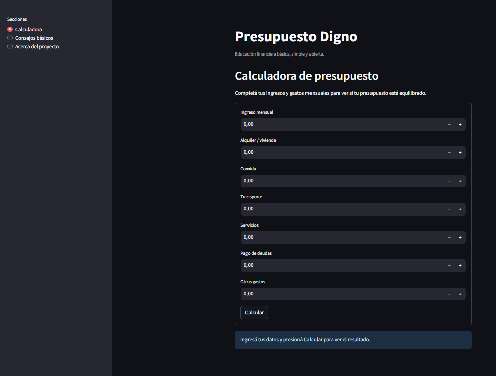
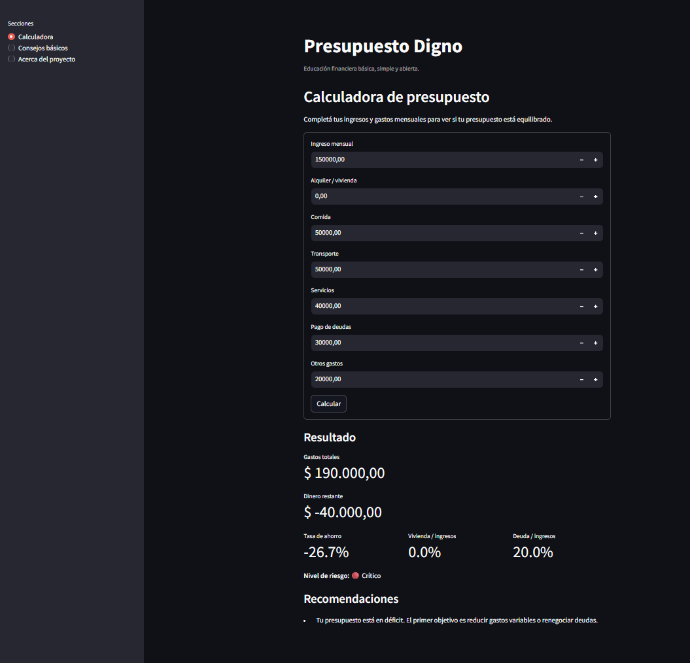

# Presupuesto Digno

Presupuesto Digno es un proyecto nuevo, MVP open-source orientado a educación financiera básica para personas y familias de bajos ingresos.

## Misión

Ofrecer una herramienta simple, gratuita y en español para ayudar a entender si un presupuesto mensual está equilibrado.

## Por qué importa

Muchas decisiones financieras cotidianas se toman con poca información clara. Este proyecto busca dar una primera orientación práctica, sin prometer resultados ni reemplazar asesoramiento profesional.

## Funcionalidades

- Calculadora de presupuesto mensual.
- Cálculo de gastos totales, dinero restante y tasa de ahorro.
- Cálculo del porcentaje destinado a vivienda y deudas.
- Nivel de riesgo básico: estable, necesita atención o crítico.
- Recomendaciones simples en español.
- Sección de consejos financieros básicos.

## Screenshots





## Instalación

Requisitos:

- Python 3.12
- pip

```bash
git clone https://github.com/sebad/presupuesto-digno.git
cd presupuesto-digno
python -m venv .venv
source .venv/bin/activate
pip install -r requirements.txt
```

En Windows PowerShell:

```powershell
python -m venv .venv
.\.venv\Scripts\Activate.ps1
pip install -r requirements.txt
```

## Cómo ejecutar localmente

```bash
streamlit run streamlit_app.py
```

## Cómo ejecutar los tests

```bash
pytest
```

## Roadmap

- Mejorar la accesibilidad visual de la interfaz.
- Agregar ejemplos educativos sin recopilar datos personales.
- Sumar más consejos básicos sobre ahorro, deudas y gastos variables.
- Traducir el README a otros idiomas si la comunidad lo necesita.

## Cómo contribuir

Las contribuciones son bienvenidas. Podés abrir un issue con una idea, reportar un problema o enviar un pull request con una mejora pequeña y enfocada.

Antes de contribuir, leé [CONTRIBUTING.md](CONTRIBUTING.md) y [CODE_OF_CONDUCT.md](CODE_OF_CONDUCT.md).

## Licencia

Este proyecto está disponible bajo la licencia MIT. Ver [LICENSE](LICENSE).
